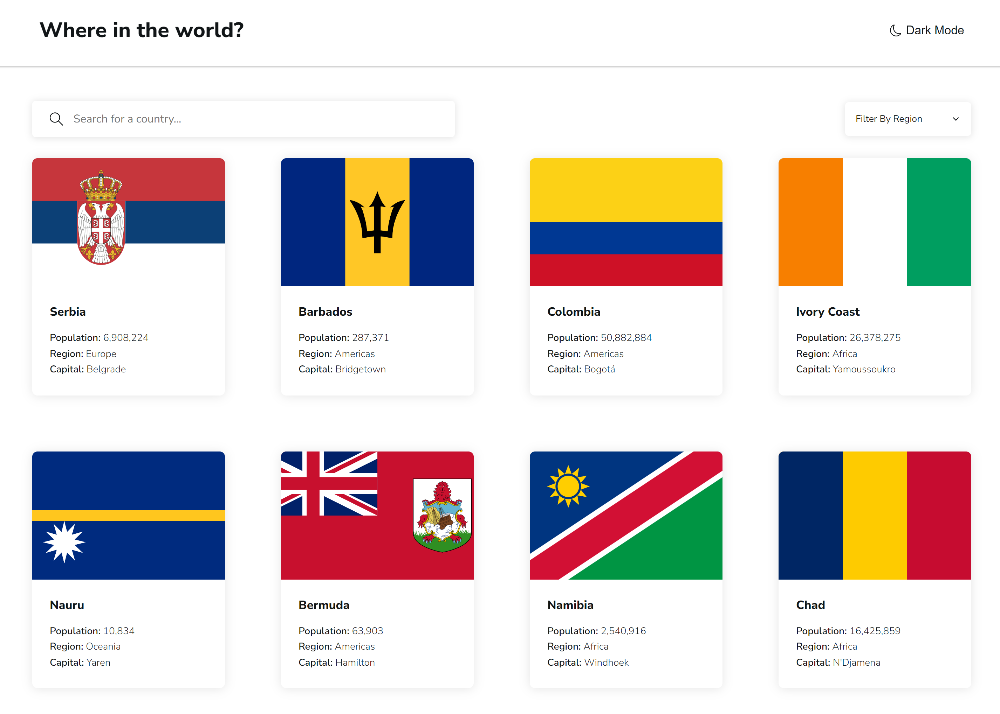
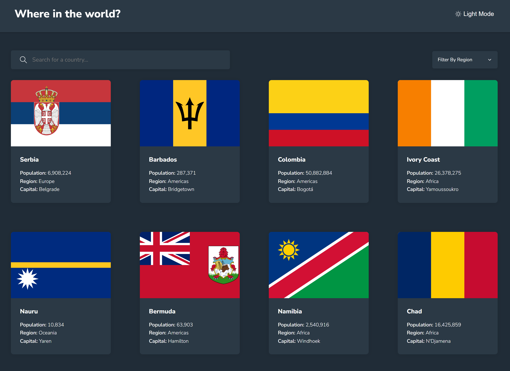
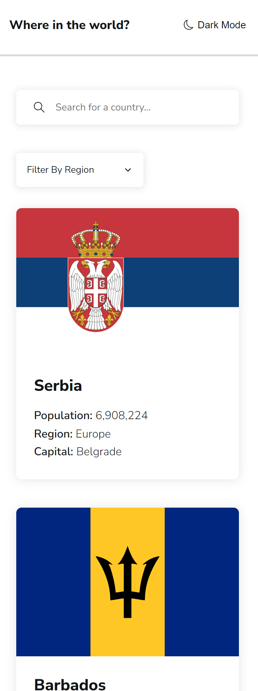
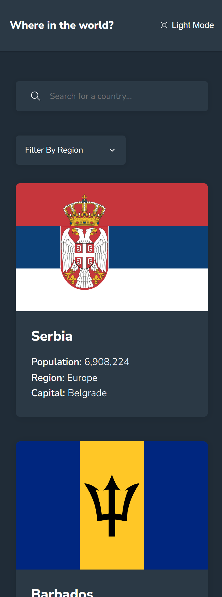

# Hi Everyone!😀

I really wanted to challenge myself and wanted to develop something that will help me practice working with API requests. So I ended up starting an Advanced level challenge from frontend mentor and WOW a challenge I definitely got. Coding and creating the pages, components and styles were fine but adding the functionality was difficult indeed. After many errors and bugs, I finally managed to get it to work! However, it may need a little bit more work and maybe some refactoring in the future. Other than that, it was fun to code and I have learnt quite a lot doing this challenge.

Note to anyone attempting this challenge: Optional chaining (<strong>?.</strong>) and Nullish coalescing operator (<strong>??</strong>) will be your best friend!

Check out the link for this project: [https://jcasia-rest-countries-api.netlify.app/](https://jcasia-rest-countries-api.netlify.app/)
Website of REST countries API :[https://restcountries.com/](https://restcountries.com/)

### I built this project using:

- React with Vite
- React Query
- React Router
- SASS

### Here are some screenhot of the project:

